<div align="center">



**On-device session titles and descriptions for your coding agents.**
No API calls, no telemetry, no session content leaving your machine.

[](LICENSE)
[](https://nodejs.org)
[](#requirements)
[](#privacy)
[](https://huggingface.co/desert-ant-labs/title)

</div>

---

Your agent's session list is a wall of `New session` and `Untitled`. quick-titles reads the first
prompt, writes a real title in about a second, and puts it in the session's own name slot — using a
350M-parameter model running **locally on your GPU**. The description goes alongside it, surfaced by
`quick-titles sessions`.

Works with **Claude Code**, **Codex CLI**, **opencode2** (beta), and **Pi**.

## Quickstart

> **Status:** v0.1.0 is in development and not yet published to npm. The commands below are the
> target interface.

**Claude Code**

```bash
npx quick-titles install claude-code
```

**Codex CLI**

```bash
npx quick-titles install codex
```

**opencode2** (beta)

```bash
npx quick-titles install opencode2
```

**Pi**

```bash
npx quick-titles install pi
```

**Then fetch the model, once**

```bash
npx quick-titles provision
```

Anything not working?

```bash
npx quick-titles doctor
```

**To remove it again**

```bash
npx quick-titles uninstall
```

That removes it from every agent you installed it into. `npx quick-titles uninstall codex` removes
it from one. Only the files quick-titles itself wrote are touched — a file of your own that happens
to share the name is left alone and reported — and the model is kept, so a later reinstall does not
download it again.

## What you get

| | |
|---|---|
| **Title** | 3–8 words, in the session's own slot — not a separate sidebar you have to check |
| **Description** | One or two sentences of what the session actually covered |
| **Refine** | A second pass on a later turn, once there is more to go on |
| **Refuse** | If the model produces something unusable, quick-titles writes nothing and your host's own title stays. A token loop never reaches your session list |

## How it works

```
your prompt ─▶ host adapter ─▶ resident daemon ─▶ granite-4.0-350m (q8_0) ─▶ session title
                                      │
                                      └─ loads once, answers in ~800 ms
```

A small resident daemon loads the model once and answers over a local socket; the adapters are thin
clients that never block your session on a missing daemon. If the daemon is not running and cannot
be started, every adapter degrades to doing nothing — no title, no error, no slowdown.

## Supported agents

| Agent | Integration | Titles |
|---|---|---|
| **Claude Code** | `SessionStart` + `UserPromptSubmit` hooks | Session title, visible in `/resume` |
| **Codex CLI** | `notify` callback + `thread/name/set` | Thread name, visible in the sidebar |
| **opencode2** (beta) | Plugin API | Session name |
| **Pi** | Extension API | Session name |

**Known limitation:** ChatGPT-app Codex threads cannot be titled — those titles live on OpenAI's
servers, and there is no supported way to write one.

## Requirements

- **Node 20 or newer.** The Pi extension is the one exception: it runs inside Pi, and Pi's SDK
  requires Node 22.19 or newer (it imports `globSync` from `node:fs`, which Node 20 does not
  export). The other three adapters work on Node 20.
- **~380 MB of model weights**, fetched once by `quick-titles provision` and checksum-verified
  before they are put in place. Every run after that is offline. This build has no published weights
  URL yet — see [docs/install.md](docs/install.md) for the three ways to supply a model today.
- **Windows GPU acceleration uses Vulkan** by default and needs only your GPU drivers. CUDA is used
  automatically if the CUDA Toolkit (13.1+, or 12.4+ for 12.x) is already installed. quick-titles
  never compiles anything — if neither is available it falls back to CPU.
- **NPUs are not supported.** llama.cpp does not target them; GPU or CPU only.

Prefer the slower path on purpose? quick-titles uses whatever backend is available by default.

## Privacy

Everything runs locally. Your prompts and transcripts are read from disk, summarised on your own
hardware, and written back to your agent's own session store. Only two commands touch the network,
both of them one-time and both of them yours to run: `provision` fetches the converted model, and
`model-build` fetches the weights it converts. Once a model is in place quick-titles makes
**no network requests at all** — no telemetry, no analytics, no crash reporting. Nothing is ever
uploaded, by either command.

## Model and attribution

The title model is [`desert-ant-labs/title`](https://huggingface.co/desert-ant-labs/title), a
fine-tune of [`ibm-granite/granite-4.0-350m`](https://huggingface.co/ibm-granite/granite-4.0-350m),
converted to GGUF q8_0 by this project. **All credit for the model belongs to Desert Ant Labs** —
quick-titles is a delivery mechanism for their work, not a competitor to it.

> Powered by Desert Ant Labs

That line is a licence requirement, not a courtesy, so it is emitted verbatim by
`quick-titles --version`, `quick-titles sessions`, `quick-titles doctor`, and the daemon's startup
log as well. Their licence (§6) forbids distributing the model "or a substantially unmodified
derivative … as a standalone product, model, SDK, or hosted service", and a converted GGUF is both a
derivative and, on a release page, standalone. That is why quick-titles converts on your machine,
from the publisher's own download, instead of publishing the file as a release asset. See
[LICENSE-NOTICE.md](LICENSE-NOTICE.md) for the clause in full and the argument on both sides.

Inference runs on [llama.cpp](https://github.com/ggml-org/llama.cpp) via
[node-llama-cpp](https://github.com/withcatai/node-llama-cpp). See [LICENSE-NOTICE.md](LICENSE-NOTICE.md)
for the full third-party notices.

## Documentation

- [Installation and platform notes](docs/install.md)
- [Adapter verification](docs/adapter-verification.md) — what was tested against which version, including what did not work
- [Implementation plan](docs/plans/2026-09-14-quick-titles.md)
- [Defect register](docs/plan-deviations.md) — every place the implementation diverged from the plan, with the evidence

## Contributing

Contributions are welcome, and this project has unusually specific constraints, so
[CONTRIBUTING.md](CONTRIBUTING.md) is worth reading before the first pull request. The short version,
and the reason each one exists:

- **Prebuilt binaries only.** Nothing is ever compiled on a user's machine.
- **The prompt is immutable.** The instruction and chat template are vendored byte-for-byte from
  the model and hash-pinned. A paraphrase is a different task.
- **The weights are never committed, published, or attached to a release.** A converted GGUF is a
  derivative, and the licence forbids distributing a derivative as a standalone model.
- **Adapters no-op rather than degrade.** A wrong title is worse than the host's own title.
- **New tests come with a mutation check** — break the source, watch it go red, put it back. If it
  stays green, the test is not testing what it claims.

Divergences from the plan go in [docs/plan-deviations.md](docs/plan-deviations.md); dead code you
find along the way goes in `to-delete.md`, not into the commit.

By participating you agree to the [Code of Conduct](CODE_OF_CONDUCT.md). Security issues go through
[SECURITY.md](SECURITY.md), not the issue tracker.

## License

MIT. The model weights are licensed separately under the
[Desert Ant Labs Source-Available License 1.0](https://license.desertant.com/1.0).

<div align="center">
<sub>Powered by <a href="https://huggingface.co/desert-ant-labs/title">Desert Ant Labs</a></sub>
</div>
